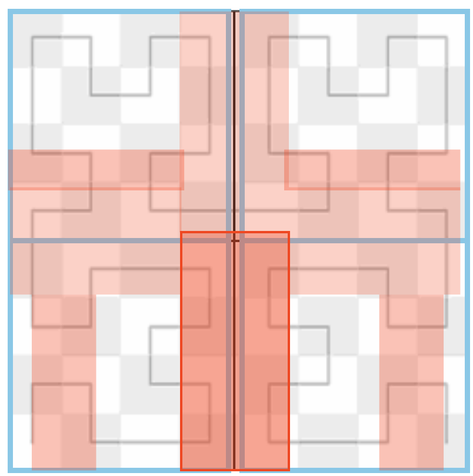
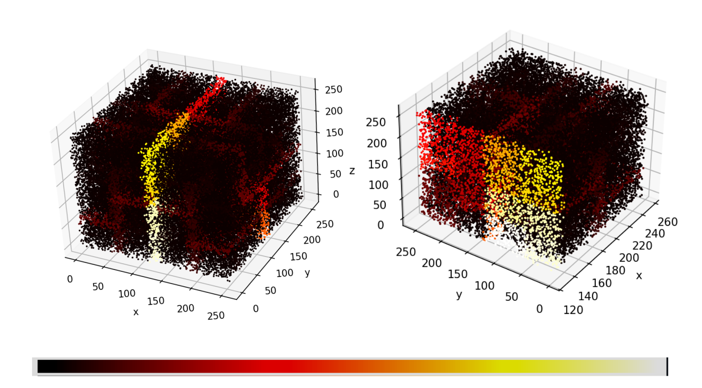
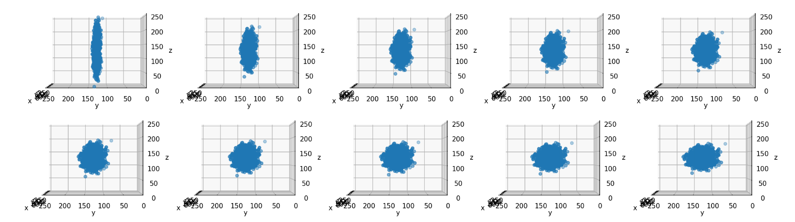
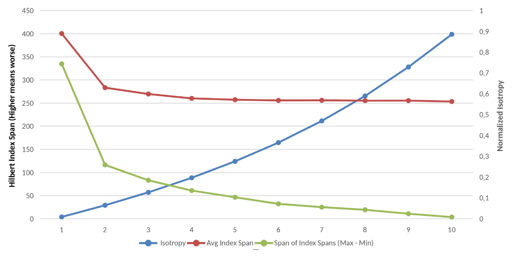
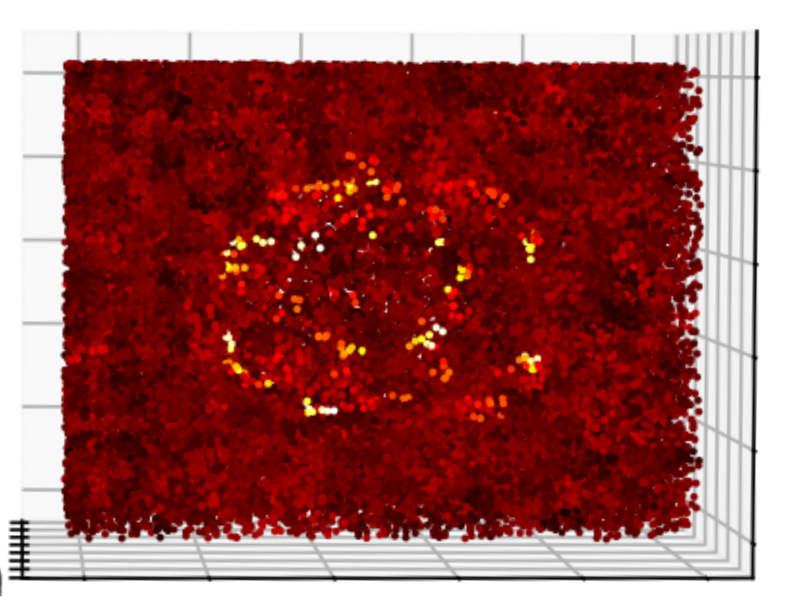

# Geometric and Topological Aspects of the Hilbert Curve in the Context of Data Indexing
The Hilbert curve is a space filling curve, widely used for indexing data. The basic concept of space filling curve dates back to the end of the 19th century, when George cantor discovered, that the unit interval in R has the same cardinality than the unit interval in R². A space filling curve, traverses every point R² in a certain order. Since there are non-denumerable infinitely many points in R², the final curve fills the whole square. A whole introduction to space filling curves, in particular the Hilbert curve, can be found in my TDS artical: https://towardsdatascience.com/the-beauty-of-space-filling-curves-understanding-the-hilbert-curve/

This repository analyses three aspects of the Hilbert curve with respect to data indexing:
- Regions with different qualities for preserving neighborhoods due to geometrical invariants
- Indexing data with different isotropy under rotations of the S03 symmetry group
- Topological ignorance: How voids decrease the performance of the Hilbert curve

## 1.Regions with different qualities for preserving neighborhoods due to geometrical invariants
The Hilbert curve exhibits regions where different segments collide or overlap, leading to local discontinuities in the index mapping.In those areas, the preservation of locality is lower than in others. 

The following graphic shows areas (red) where indices of the 2D Hilbert curve are far apart for neighboring points.

To measure the aspect of preserving neighborhoods in indices for points lying close by in the dataset, I have computed average index span for the k-nearest-neighbors of each point. 

$$
knn\_idx\_range\_span
= \frac{1}{n} \sum_{i=1}^{n}
\left(
\max_{x_j \in \mathrm{knn}(x_i)} H(x_j)
-
\min_{x_j \in \mathrm{knn}(x_i)} H(x_j)
\right)
$$

$H(x_j)$ is the Hilbert index of the j-th neighbor of the datapoint $x_i$.

Computing a heatmap based on this measure shows that there are certain axes/areas where this Hilbert curve keeps indices close for neighboring points (dark areas), while for others indices for neighboring points are far apart (light/yellow areas).

## 2. Indexing Data With Different Degrees of Isotropy Under Rotations of the S03 Symmetry Group

Since the Hilbert curve has quadrants of „good“ performance and axes of bad performance (heatmap in section 1), the degree of isotropy strongly influences the indexing performance

To check how the property of isotropy correlates with the indexing performance of the Hilbert curve, ten gaussian clusters with fixed volume but different degrees of isotropy i.e. different extensions along the axes in 3D were created.

For every point in the dataset: Measure the knn_idx_rank_span and compute the average value.

Additionally: Rotate every cluster by using the transformations of the SO(3)/octaeder symmetry group to evaluate how this changes the average rank span. 

The isotropy of a gaussian cluster is measured via the eigenvectors of the covariance matrix:

$$
\frac{\lambda_{\min}(\Sigma_X)}{\lambda_{\max}(\Sigma_X)}, 
\quad \lambda \text{ denotes an eigenvalue}
$$

<b>Result</b>: As shown in following figure, the performance of the Hilbert curve improves according to the knn_rank_span measure when the isotropy increases. This is due to the fact in the experiment the elongated clusters intersect precisely the low-locality regions of the Hilbert mapping. The cluster with higher isotropy hits them as well but not exclusively which averages out the effect.
Both the geometry and orientation of the data strongly affect index performance.

## Topological Ignorance: How Voids Decrease the Performance of the Hilbert Curve

Void areas in the data can create gaps in the index range of a space-filling curve (SFC), since the geometry of the curve is fixed. As the curve traverses these voids, it disregards the topological structure of the data. This may lead to the isolation of certain points, as their predecessors and successors (according to the Hilbert index) are removed from the grid. Consequently, coarse errors can occur. For example, when the points within the yellow circle are deleted, new purple edges emerge due to the updated neighborhood on the one-dimensional axis. Compared to the usual Hilbert curve edges of length 1, these new edges have lengths of $\sqrt{5}$ and $\sqrt{8}$. The diagram on the right illustrates an ordering that preserves locality more effectively, with edge lengths of 1 and $\sqrt{2}$.

To evaluate this intuition by data the following was measured for a dataset of uniformly distributed data with a void:
 For k (= 10) predecessors and successors of each point: What is the span of the distances of these points in 3D. Color points according to the distance - span 

$$
\mathrm{grid\_dst\_span\_for\_idx\_knn}
=
\frac{1}{n}
\sum_{i=1}^{n}
\left(
\max_{\substack{H(x_j) \in \mathrm{knn}(H(x_i))}}
\left\lVert x_i - x_j \right\rVert^{2}
-
\min_{\substack{H(x_j) \in \mathrm{knn}(H(x_i))}}
\left\lVert x_i - x_j \right\rVert^{2}
\right)
$$

 Where $H(x_i)$ is the Hilbert index of $x_i$.

The heatmap shows that points near the void boundary exhibit larger spatial distance ranges among their nearest index-space neighbors as predicted by the former plot.

